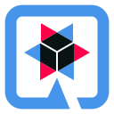
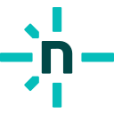

## Olá, eu sou Augusto Cesar! 🖖🏻

Sou formado em Ciências da Computação pela UNIP, atualmente estudando para se tornar um desenvolvedor Java.

Atualmente estou criando um projeto para gestão de rotinas administrativas para ONGs <a href="https://github.com/augustocesarsousa/gerenciador_de_rotinas" target="_blank">[link do projeto]</a>, esse projeto irá utilizar Java com SpringBoot no backend e Angular no frontend, nesse primeiro momento, ele irá contemplar rotinas financeiras como fluxo de caixa.

Também criei o software GR (Gerenciador de Rotinas) para a Lojas Don Paco <a href="https://github.com/augustocesarsousa/gerenciador-rotinas" target="_blank">[link do projeto]</a> utilizando a linguagem de programação Java, ele complementa tarefas não supridas pelo ERP principal da empresa, seus módulos principais são:

- Assistência técnica;
- Controle e liberação de mercadorias;
- Dashboard para acompanhamento de metas dos vendedores;
- Pesquisa de produtos com detalhamento fiscal;

### Tecnologias e ferramentas que tenho conhecimento

  
  
  
  
  
  
  
  
  
  
  
  
  
  
  
  
  
  
  
  
  
  
    
    
  
  
  
  
  

### Contatos

 
  
  

<!-- https://github.com/devicons/devicon -->
